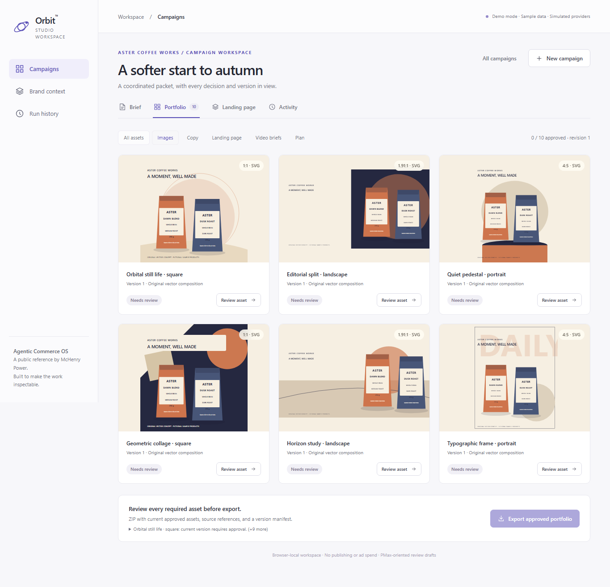
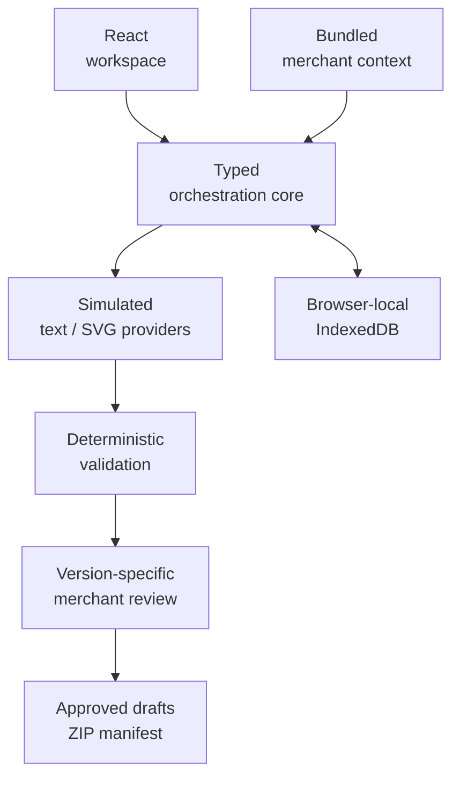

# 🪐 Orbit™
### Agentic Commerce OS

**Brief a campaign. Coordinate its creative assets. Review and export one coherent portfolio.**

McHenry Power · Product Architect & Developer<br>
Current focus: **Orbit Studio — campaign creative orchestration**<br>
Status: **Runnable public reference · Sample data · Simulated providers**

[Try the demo](https://mchenry-power-dev.github.io/orbit-agentic-commerce/) / [Run locally](#run-it) · [Workflow](docs/workflow-and-domain.md) · [Architecture](docs/architecture.md) · [Validation](docs/testing-and-evaluation.md) · [Gallery](docs/product-gallery.md)

TypeScript · React · Vite · IndexedDB · Vitest · Playwright

---

## 🧭 The workflow

Campaign imagery, copy, video concepts, and landing-page material require substantial manual switching between tools. Orbit Studio explores how a shared brief and explicit review process can coordinate that work across a portfolio.

**Brief → context → plan → generate → validate → review → export**

| Input | Orchestration | Output |
| --- | --- | --- |
| Goal, products, audience, direction | Snapshot context; specify assets | Six coordinated SVG compositions |
| Offer, tone, keywords, phrases | Execute bounded jobs; validate | Headlines, descriptions, CTAs, storefront drafts |
| References and preferences | Preserve versions; require review | Landing preview, video brief, blueprint, ZIP |

**A complete vertical slice.** Start with an explicitly populated coffee campaign or a new brief. A fictional household-consumables merchant demonstrates reuse. Inspect included products, brand rules, references, and page content; exclude a reference when appropriate.

Square, landscape, and portrait treatments share stable packaging and product facts. The landing preview uses the same messages and artwork. The video brief contains a script, shots, and generation instructions, rather than a playable video.

## 🖼️ See it work

[](https://mchenry-power-dev.github.io/orbit-agentic-commerce/)

*Working reference demo · Sample data · Simulated providers*

The [gallery](docs/product-gallery.md) shows the working application. Follow the [demo guide](docs/demo-guide.md) to inspect, revise, approve, and export the sample portfolio.

**Review stays with the merchant.** Inspect each asset's purpose, context, findings, and version. Targeted revision preserves unrelated outputs and removes the changed item's approval. Core brief/context edits make affected outputs stale. Export explains missing, invalid, stale, or unreviewed requirements.

---

## Run it

Use Node.js **22.12 or newer**; the reference is tested with **Node 24.18.0 and npm 11.16.0**. From the repository directory:

```sh
npm ci
npm run dev
```

Open the local URL printed by Vite, including `/orbit-agentic-commerce/`. Choose **Try sample campaign**, review the brief and context, then **Create portfolio**. No API keys, account connections, paid services, or runtime external APIs are needed.

**Local state is deliberate.** IndexedDB retains campaigns, revisions, approvals, preferences, and events across refreshes in one browser/origin. Closing the browser stops work. Resume/restart is local recovery, without cross-device sync. Reset requires confirmation. Installation/browser tooling may need network access; the sample workflow does not.

The [full guide](docs/demo-guide.md) covers validation, recovery, and downloads. Use one active editing tab.

## 🛠️ Engineering decisions

The React-independent core exposes typed brief revisions, provenance, asset versions, findings, approvals, and export references. Provider and persistence interfaces separate simulated generation from real state transitions.

| Challenge | Implemented approach | Inspect |
| --- | --- | --- |
| Context provenance | Snapshots with provenance | [Context/planner](src/fixtures/index.ts) |
| Provider boundaries | Deterministic context-aware adapters | [Provider contract](src/orchestration/index.ts) |
| Recoverable state | Persistence, bounded retries, start guard | [Engine](src/orchestration/index.ts), [persistence](src/persistence/index.ts) |
| Targeted revision | Append one asset version | [Behavior tests](tests/core.test.ts) |
| Approval/export safety | Check versions and manifest | [ZIP/export gates](src/export/index.ts) |



**Small interfaces, explicit limits.** Free-text direction remains visible in the blueprint; deterministic providers support a defined vocabulary rather than interpreting arbitrary instructions. Saved composition preferences influence supported planning choices. That is preference reuse, not model training or demonstrated performance optimization.

---

## Verified behavior

**30 unit tests and 16 Chromium browser checks pass.** They cover validation, context exclusions, recovery, targeted revision, approval invalidation, export gates, and ZIP references. All five evaluation scenarios pass within the unit suite. [Results and limits](docs/testing-and-evaluation.md) include desktop/narrow evidence. The [sample packet](samples/approved-campaign/) comes from the same pipeline with synthetic provenance.

The generated packet includes a version manifest and source references. Open its files alongside the blueprint to inspect how the brief becomes one coordinated deliverable.

**Real engine, simulated generation.** The state model, orchestration, persistence, validation, review, and ZIP assembly execute in this reference. Store retrieval uses fixtures; text uses rules; images are original SVG compositions. Tests establish implemented behaviors, not semantic creative quality, ad approval, revenue, or conversion gains.

The [channel specification](docs/channel-specs.md) separates Google requirements, recommendations, and Orbit defaults. SVG drafts are not upload-ready PNG/JPG ads; the copy CSV is a review artifact. This Performance Max-oriented subset does not establish complete campaign compliance.

## 🌱 Direction and ownership

| Implemented here | Simulated here | Next production step |
| --- | --- | --- |
| Planning, recoverable runs, review, export | Store context, text, image generation | Authorized store and model adapters |
| Versioned rules and local preference reuse | Provider delays and failure fixtures | Authenticated execution and measured feedback |

Cosmic Cat Coffee Co. is the operating business and intended customer-zero environment, not evidence of an Orbit deployment. Its [public commerce lab](https://github.com/mchenry-power-dev/cosmic-cat-commerce-lab) describes that operating context. [Loom™](https://github.com/mchenry-power-dev/loom-public) addresses subscription-commerce infrastructure; Orbit demonstrates reusable orchestration. A roughly ten-minute brief is a design target, not a measured result.

McHenry Power owns the product direction and architecture; development used AI assistance. This **public reference implementation** makes source inspectable without an open-source license grant. [Source/asset notes](docs/source-and-asset-notes.md) explain provenance, dependencies, and trust boundaries; the [roadmap](docs/roadmap.md) separates future integrations from delivered behavior.

[McHenry Power on LinkedIn](https://www.linkedin.com/in/mchenry-j-power-mba)
