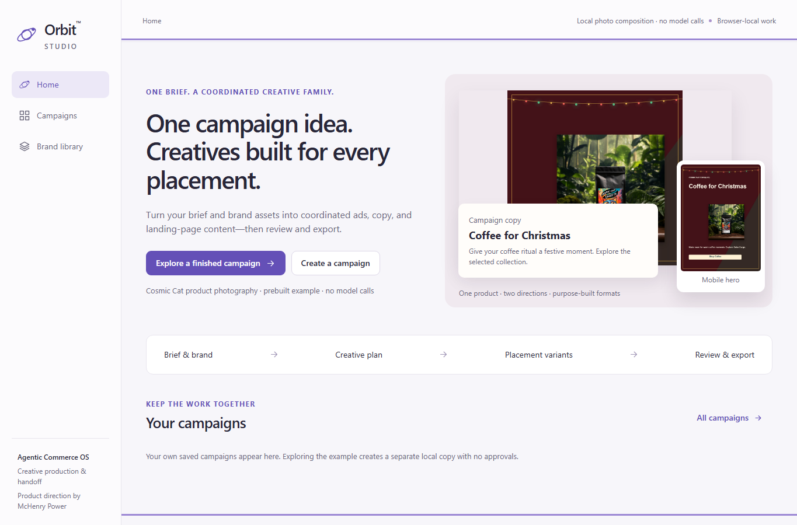

# 🪐 Orbit™

### Agentic Commerce OS

**One campaign brief. Two creative directions. A coordinated, reviewed set of placement variants.**

McHenry Power · Product Architect & Developer<br>
Current focus: **Orbit Studio — campaign creative orchestration**<br>
Status: **V2 candidate · Authorized public brand snapshot · Local photo composition**

[Current public V1 demo](https://mchenry-power-dev.github.io/orbit-agentic-commerce/) · [Workflow](docs/workflow-and-domain.md) · [Architecture](docs/architecture.md) · [Checks](docs/testing-and-evaluation.md) · [Brand provenance](docs/brand-provenance.md)

TypeScript · React · Vite · IndexedDB · Vitest · Playwright

---

## 🧭 Why Orbit Studio

McHenry Power's experience operating Cosmic Cat Coffee Co. shapes Orbit's central problem: one campaign requires coordinating product facts, audiences, offers, budgets, imagery, copy, landing pages and approvals. Creative production adds repeated manual rework. An image suited to an ad placement may need different framing, product visibility and text space for a desktop or mobile page. That friction limits campaign frequency and encourages reuse of older creative.

The workflow begins with a description and selected products, followed by an editable interpretation. Audience, offer, references, directions and actual placement targets stay visible together. Advertising budgets describe currency, period, daily/lifetime intent and channel allocation; they are planning assumptions, separate from generation costs or spending.

**Brief and brand → creative plan → two families → placement variants → review → export**

Orbit's thesis is to make this coordination software. The intended feedback loop connects creative, page and budget hypotheses with later measured performance. This reference implements review and revision without connected advertising accounts or performance feeds.

## 🖼️ Start with a finished campaign

The V2 candidate opens with an authorized Cosmic Cat Christmas example. Solar Surge's verified record and unchanged packaging photo anchor two creative families, adapted for selected Google, Meta and website targets. Website heroes include text; Google image assets keep copy separate.



_V2 candidate · Authorized Cosmic Cat photos · Prebuilt local composition · No model calls._

**Explore a finished campaign** copies the example into local work without carrying over merchant approvals. **Create a campaign** begins a new brief. A contrasting cool summer direction can reuse the same protected product photo while changing the surrounding palette, arrangement and copy. The original photo remains intact; local composition creates a graphic treatment around it.

The [brand provenance](docs/brand-provenance.md) records retrieval dates, original image URLs, hashes and the boundary between product facts and visual inspiration. Aster and Harbor remain preserved regression fixtures and earlier saved campaigns remain available separately. Custom brands use confirmed facts and owned uploads; URL importing reports actual successes and failures when its service is configured.

---

## Run it

Use Node.js **22.12 or newer**. The recorded workspace toolchain is **Node 24.18.0 and npm 11.16.0**. From the V2 repository checkout:

```sh
npm ci
npm run dev
```

Open Vite's local URL, including `/orbit-agentic-commerce/`. The bundled sample and local photo-composition workflow require no model key or paid provider. Choose a finished example, inspect its creative family, review exact outputs and download the approved packet. The linked public Pages application is the earlier V1 reference until V2 deployment is explicitly verified.

IndexedDB retains drafts, campaigns, versions, decisions and events across refreshes. Closing the browser stops work; completed outputs remain checkpoints. Storage is browser/origin-specific. Navigation preserves unfinished work; local deletion requires confirmation.

## 🛠️ Engineering boundaries

The framework-independent engine separates campaign intent, creative families, placement recipes, raster outputs and exact approvals. A text-only offer change invalidates relevant copy and overlaid artwork while preserving unrelated image approvals. A targeted revision appends one version; changing a family invalidates that family's dependent variants. Bounded failures remain visible and completed outputs survive recovery.

| Capability                  | V2 boundary                                                               |
| --------------------------- | ------------------------------------------------------------------------- |
| Works locally               | Typed orchestration, PNG/JPEG composition, persistence, review and ZIP    |
| Sample or composed          | Authorized Cosmic Cat snapshot; bounded local theme interpretation        |
| Requires configured service | Public URL import, semantic planning and live image generation            |
| Roadmap                     | Account connections, publishing, rendered video and measured optimization |

Local interpretation recognizes a bounded set of Christmas/gifting, summer/cool and editorial cues. It records its limits and requires confirmation. Arbitrary free-text semantics require the planning service. Live generation must fail visibly when unavailable; it must never silently return a local composition under a live label. Implemented service contracts and mocked tests do not prove live calls or public hosting.

---

## Evidence and export

The [V2 tests](tests/studio.test.ts) cover contrasting briefs, complete phrases, sources, budgets, placements, dependencies, recovery and exact exports. A clean rehearsal passed **40 browser cases** (24 V2, 16 legacy). Subsequent service updates passed **130 unit tests** and build, plus focused production captures. The [testing guide](docs/testing-and-evaluation.md) distinguishes those runs and records a local preview-teardown limitation. The [gallery](docs/product-gallery.md) contains real app captures with prebuilt and newly composed work labeled.

Exports contain current approved versions, real raster files, editable recipes, placement copy mappings and source provenance. CSV and JSON are review artifacts, not verified platform import schemas. Merchant approval applies to an exact version and remains separate from account connection and platform policy approval.

Google checks use dated first-party specifications for the supported measurements. Meta's official guides were unavailable during verification, so its rules remain **Not checked**. Website and email dimensions are configurable design goals. TikTok and Google video concepts remain scripts and shot lists; they are not playable video. No packet claims complete campaign compliance or automatic advertising approval.

## 🌱 Direction and ownership

Cosmic Cat Coffee Co. is the authorized customer-zero brand for this candidate. [Loom™](https://github.com/mchenry-power-dev/loom-public) addresses subscription-commerce infrastructure; Orbit explores reusable orchestration across creative work. McHenry Power owns the product direction and architecture; development used AI assistance. Public source availability adds no open-source license grant, and attribution does not turn public brand photography into unrestricted assets.

The [roadmap](docs/roadmap.md) separates delivered behavior from future account integrations and performance feedback. Full requested V2 verification remains **NO** until an owner-approved protected runtime, generation-cost ceiling and real import/planning/image journeys are verified. The existing live reference stays available while that work is completed.

[McHenry Power on LinkedIn](https://www.linkedin.com/in/mchenry-j-power-mba)
