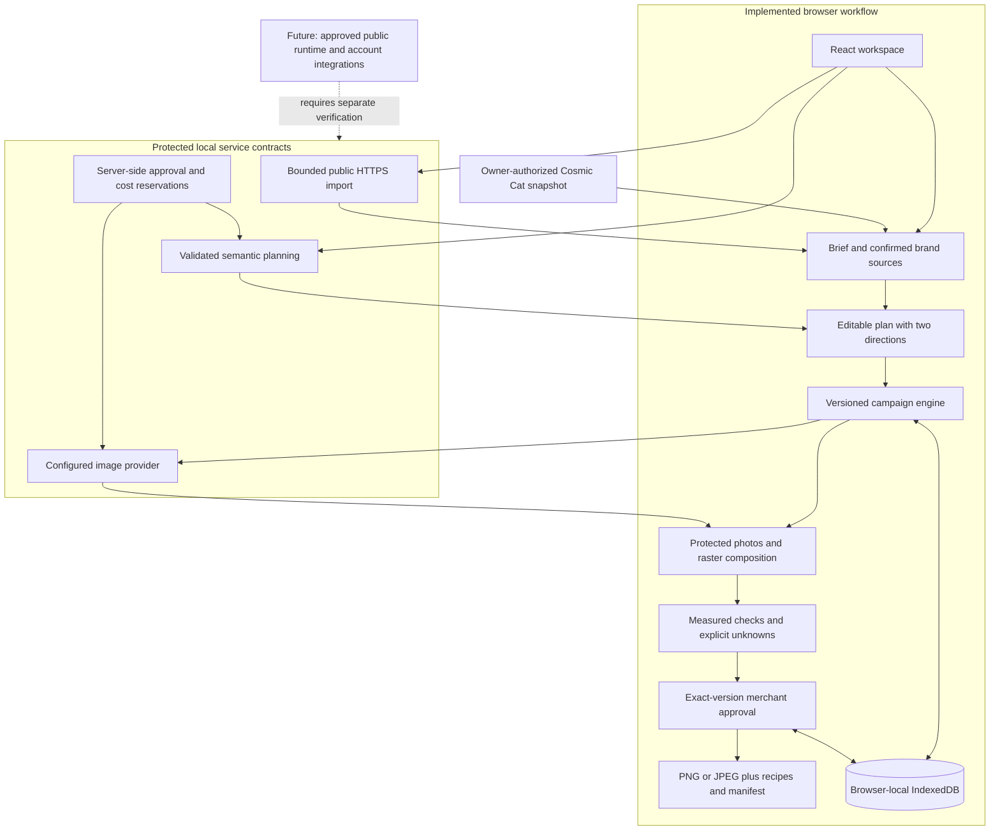

# Architecture

The V2 candidate separates a browser-local campaign workspace from a protected **local Node service**. The bundled Cosmic Cat example and local photo compositions work without model credentials. Public URL import, semantic planning and live image generation use explicit service contracts; live generation remains unverified until an approved runtime and cost allowance are supplied. The public Pages demo remains V1 while the candidate is reviewed.

## Responsibilities

| Boundary                                                                                    | Inspect                                                                                                          |
| ------------------------------------------------------------------------------------------- | ---------------------------------------------------------------------------------------------------------------- |
| Typed brief, brand sources, directions, recipes, versions and decisions                     | [Studio domain](../src/domain/studio.ts)                                                                         |
| Curated public facts and unchanged source images                                            | [Cosmic Cat snapshot](../src/fixtures/cosmic-cat.ts), [provenance](brand-provenance.md)                          |
| Bounded local theme interpretation and explicit conflicts                                   | [Local planner](../src/fixtures/studio.ts)                                                                       |
| Placement adaptation, protected photo frames and real raster encoding                       | [Composition provider](../src/providers/composition/index.ts)                                                    |
| Serialized state changes, bounded attempts, checkpoint recovery and dependency invalidation | [Studio engine](../src/orchestration/studio.ts)                                                                  |
| V2 records alongside preserved V1 data                                                      | [Persistence](../src/persistence/studio.ts)                                                                      |
| Google measurements, missing TikTok motion and unknown Meta rules                           | [Placement checks](../src/validation/placements.ts), [channel scope](channel-specs.md)                           |
| Current exact approvals, destination mappings and ZIP assembly                              | [Export](../src/export/studio.ts)                                                                                |
| Bounded import, authenticated local routes, schemas and allowances                          | [Service](../server/service.ts), [security](../server/security.ts), [provider contracts](../server/providers.ts) |

## Generation modes

**Prebuilt sample** means completed example outputs copied into local work without merchant approvals. **Local composition** means unchanged product photos framed with graphics and copy. It supports bounded Christmas/gifting, summer/cool and editorial cues; arbitrary semantic instructions require the service. It does not synthesize a new photographed scene or alter the package.

**Live generation** requires a configured semantic/image provider. A missing service is a visible failure, without a silent local substitute. Validated JSON and deterministic measurements establish structural constraints, not creative relevance. Mocked contract tests do not establish live provider quality, real paid-call success or approved public hosting.

Current instructions take priority over default brand tone and remembered preferences. The plan captures spacing preferences so later preference changes affect future plans rather than existing recipes. Required campaign-copy phrases must remain whole in actual ad-copy fields; metadata cannot satisfy them.

## Storage, recovery and exports

The engine persists completed versions and concise events as each step finishes. One active run is permitted. Local composition defaults to two attempts and 30 seconds per step. Live-mode steps allow one attempt and 75 seconds by default, avoiding automatic paid retries; the service has its own bounded timeout and reservation gates. Failure does not erase unrelated completed work. Pausing or refreshing permits missing/stale work to resume; this is local recovery, not a distributed queue guarantee.

IndexedDB stores V2 under `studio-v2` in the original database. New-campaign drafts and existing-campaign drafts are retained separately; deleting a campaign clears its matching draft, and deleting a brand clears its draft uploads. The V1 `app` record is retained, and the earlier interface is reachable with `?legacy=1`. Browser storage remains specific to profile and origin; clearing it loses local work. Memory adapters support isolated tests and preserve a separate legacy record.

Dependency fingerprints connect each asset to its plan, selected products and sources, including family image prompts and scene instructions. Text-free imagery excludes copy fields from its dependencies. An offer edit therefore changes copy, relevant overlaid images and handoff without discarding unrelated text-free image approvals. A changed family image prompt invalidates that family's variants. An edited version never inherits its previous approval. Export rechecks current source gates, supported measurements and exact approval references.

Live-mode scenes are persisted before local composition, with SHA-256 keys covering campaign, family, scene prompt and selected visual references. A local-render failure can resume from its saved scene and exact provider provenance without repeating the provider request. Revised scenes use separate keys and cannot silently replace the base scene for another missing variant. Failed targeted revisions retain their selected IDs and note across refresh/resume. These behaviors are tested with mock scenes; real paid image generation remains unverified.

Placement plans provide bounded `product-right` or `product-center` composition and spacing. These values enter actual recipes; descriptive framing/focal/negative-space notes remain review context. Equal-size placements reuse a file only when their overlay and layout choices match. Global copy edits update current placement mappings as well as campaign copy before re-review/export.

ZIP files contain real PNG/JPEG bytes, optional editable recipes, content JSON, field-mapping CSV, provenance, campaign brief and an exact-version manifest. They do not publish, change ad spend, prove a platform import schema or grant advertising policy approval.

## Service trust boundary

Import uses public HTTPS with bounded pages, assets, bytes, time and redirects. Address resolution, restricted paths and destination robots rules are checked across page redirects; requests are pinned to eligible resolved addresses. Credential-bearing, private, loopback, link-local, metadata and internal destinations are rejected. Structural extraction excludes hidden, form, navigation and recognizable review/customer sections without storefront cookies or script execution. It does not claim browser-computed visibility or universal recognition of identities in arbitrary unmarked text. Paste/upload remains available when a source cannot be imported.

Imported products remain unconfirmed with no assigned photo. Images enter as visual references until the visitor confirms ownership and explicitly associates a product photo. When extracted colors are absent, a visible editable default palette is supplied; it is not represented as a discovered brand fact.

The local service requires operator authorization, restricts frontend origins and bounds concurrency and response sizes. Provider credentials and allowance state belong server-side. Persistent cost reservations survive failed/unknown paid calls and reject repeated operation identifiers; they are operator ceilings, not proof of actual billing. Visitor budgets, sources and uploads must not become public fixture data or repository logs. Public hosting, production authentication and account integrations require separate work and verification.

Using the semantic service transmits selected brief, confirmed facts, references and planning assumptions. Image requests can transmit at most two selected, locally decoded visual references as inspiration; protected product photos remain separate composition layers. Reference input is not proof of provider fidelity or authorized live acceptance. See the [runtime boundary](provider-and-runtime.md) for limits and the missing owner-approved setup.
