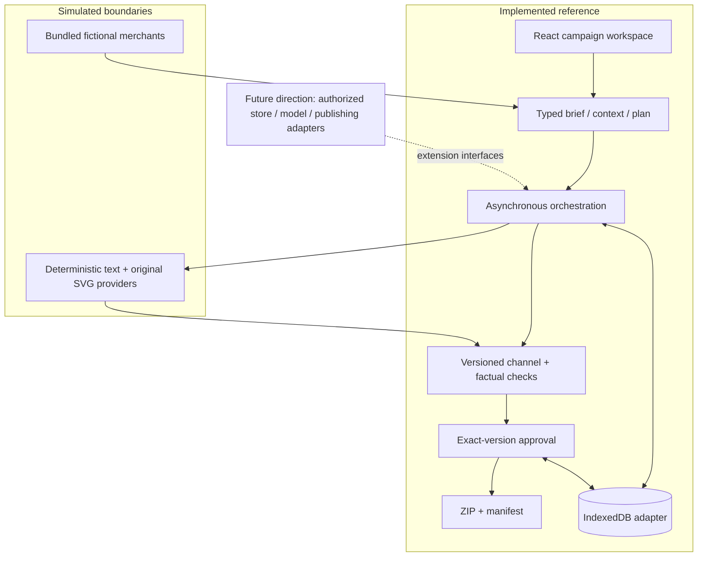

# Architecture

Orbit Studio is a static React interface over a framework-independent TypeScript campaign engine. The browser owns execution and storage. Bundled fictional context and explicitly simulated providers make the default workflow reproducible without API keys or an external service.

## Responsibilities and interfaces

| Responsibility | Contract |
| --- | --- |
| [Domain/context](../src/domain/index.ts) | Typed records; selected products are factual constraints; snapshots retain source IDs and reasons |
| [Planner](../src/fixtures/index.ts) | Converts supported brief/context/preferences into stable asset specifications |
| [Provider](../src/providers/demo/index.ts) | Receives one specification with context; returns draft content or a classified failure |
| [Orchestrator](../src/orchestration/index.ts) | Persists steps and events, limits attempts/concurrency, resumes incomplete work |
| [Persistence](../src/persistence/index.ts) | Loads/saves local state; memory adapter supports isolated tests |
| [Validation](../src/validation/index.ts) | Returns explicit findings for supported fields, facts, phrases, dimensions, and completeness |
| [Review/export](../src/export/index.ts) | Approval points to a current valid version; export rechecks gates and assembles references |

The UI never substitutes a success toast for a failed step. Events describe concise outcomes and references, not fictional reasoning transcripts. The providers' deterministic content varies with supported structured brief fields. Free-text instructions remain visible without a claim that arbitrary requests were understood.

## Demo provider vocabulary

The [demo provider](../src/providers/demo/index.ts) uses selected products and merchant category for factual content and packaging. Seasonal words in direction select seasonal copy; `concise`, `direct`, or `bold` in tone change a copy verb; a goal containing `launch` changes an image label. Keywords and the merchant-provided offer enter supported copy fields. Copy revisions containing `short` or `concise` select a short variant. `Warm`/`warmer` selects inviting language in supported copy, landing, or video fields. `More space`, `spacing`, or `less crowded` shrinks image packages by 20%; image revisions also vary arrangement by version. Composition preference controls decorative density.

Other direction/revision text remains in the blueprint, generation brief, or supporting content for human review. A request such as “use a photograph of a café” does not create a photograph; a “move the cup left” instruction is not a supported geometric command. This explicit boundary makes adapter replacement inspectable without pretending the rule-based demo is a language model.

## Recovery and concurrency

Completed asset versions and review state are persisted as the run advances. Refresh recovery resumes incomplete work or permits an explicit restart; it should not duplicate completed versions. Failure in one provider step does not erase approved unrelated assets. Timeout, provider failure, and interruption are distinct outcomes, with bounded retry attempts.

The engine runs one step at a time and permits one active campaign run. Core defaults are three attempts per step per invocation and a two-second provider timeout; the UI configures two attempts and 1.5 seconds. Explicit resume begins another bounded invocation for remaining work. A duplicate start is rejected. The app's browser-level editing lock prevents competing tabs from writing the same state. This is browser-local coordination, not a distributed exactly-once guarantee.

Closing the browser stops computation. IndexedDB state is local to that browser and origin; it is not a server queue, authenticated audit store, cross-device synchronization service, or backup. Clearing storage loses local work. The memory adapter deliberately trades durability for repeatable tests.

## Export and trust boundaries

Exports contain reviewed drafts and a manifest of exact asset versions. Core brief/context changes make the plan and affected approvals stale; a single-item revision invalidates only that item's previous approval. At download, export rechecks currency, stored validation findings, completeness, and exact approval references. It does not trust a historical approved status alone.

The interface renders provider text as data. SVG composition text is escaped and references remain local; export filenames are normalized. The demonstration does not accept arbitrary executable HTML, runtime uploads, credentials, store OAuth, tracking, or production API endpoints. It is not an authenticated production environment.

SVG drafts, a review CSV, and a video brief demonstrate coordination. Raster production, comprehensive advertising policy checks, platform import schemas, rendered video, and publishing are outside the implemented boundary. See [channel specifications](channel-specs.md), [source/asset notes](source-and-asset-notes.md), and [roadmap](roadmap.md).
