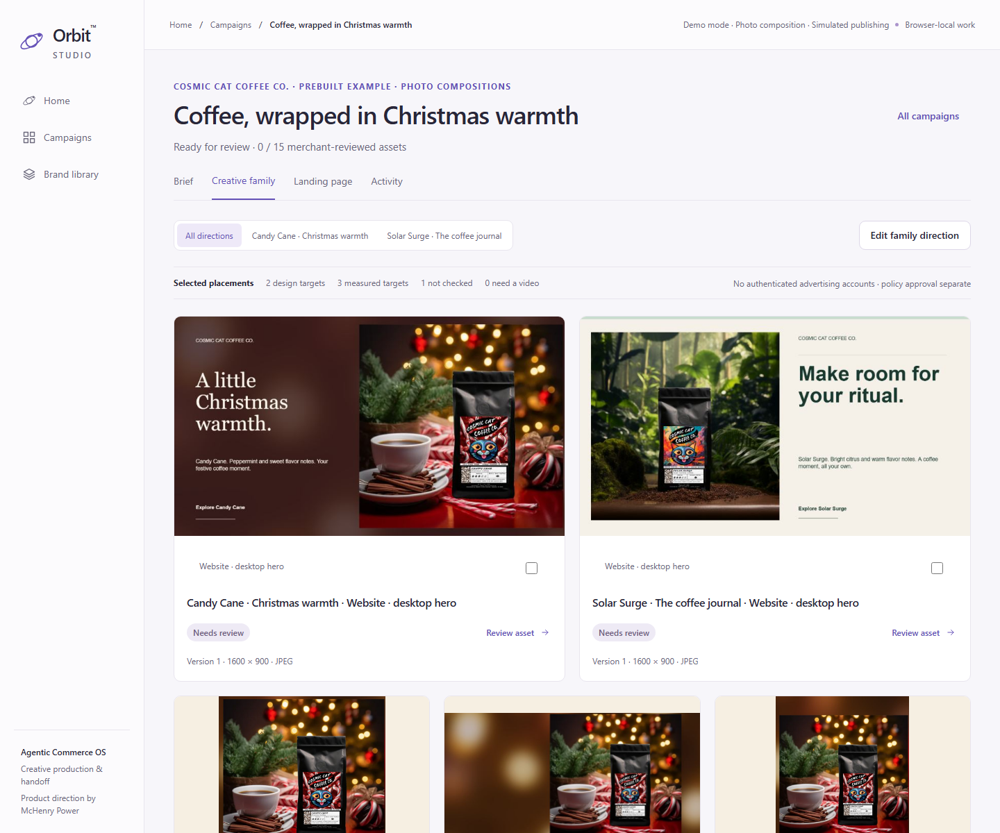
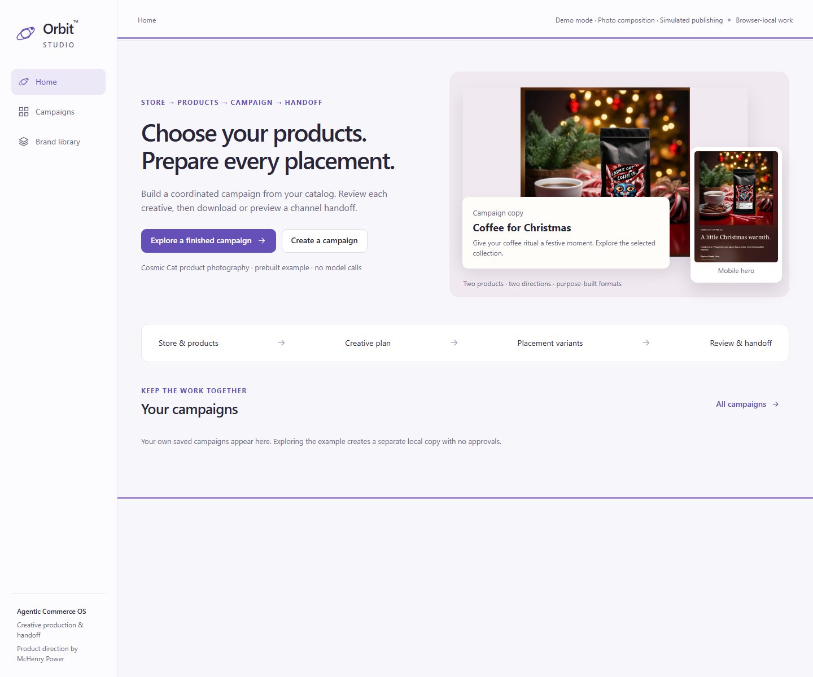
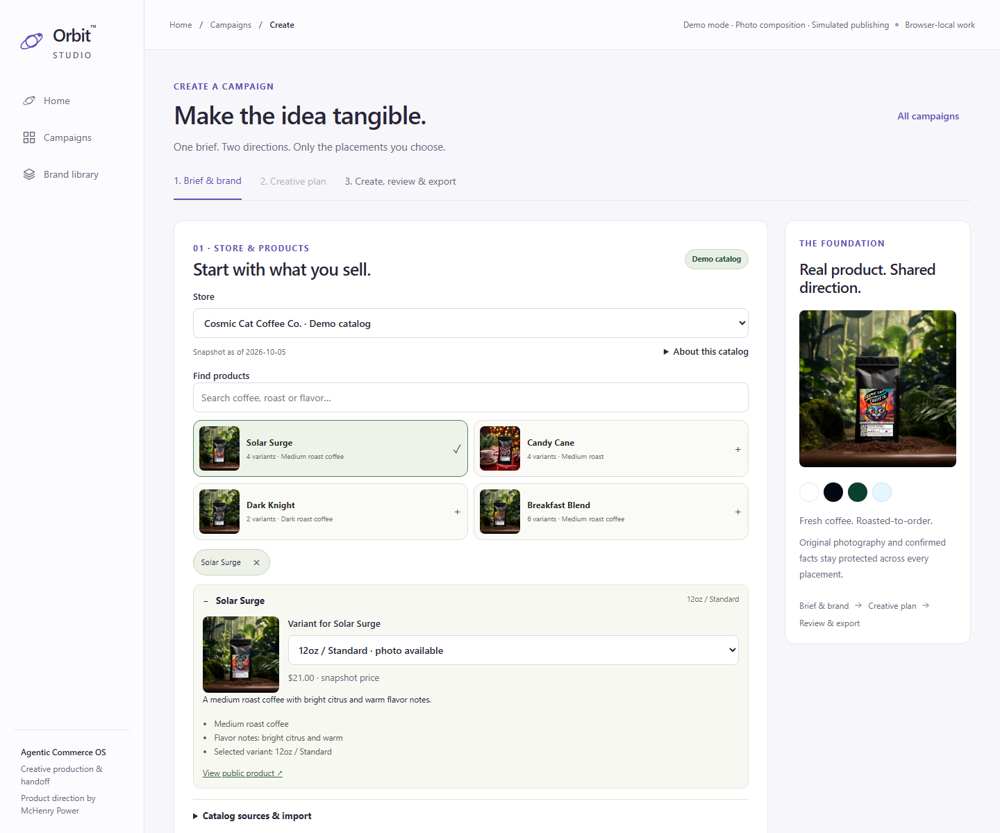
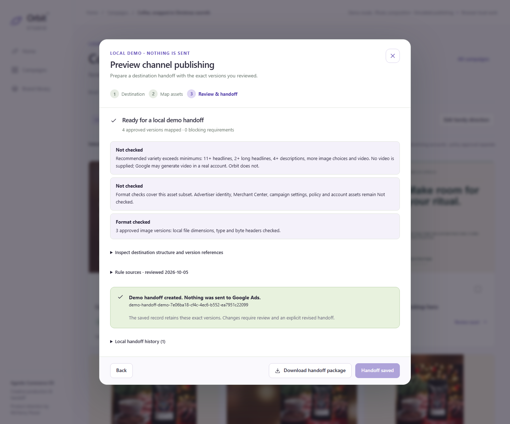
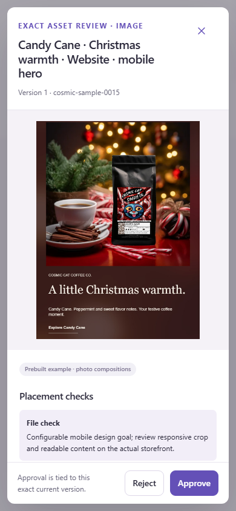

# Orbit Studio gallery

Actual application captures from the quality enhancement, **2026-10-05**. The finished Cosmic Cat campaign is prepared local photo composition. Product selection, approval and handoff states shown here come from acceptance interactions, not commercial outcomes or platform approval. The [validation record](testing-and-evaluation.md) separates local, browser and hosted checks.

## Two photographic directions

**Candy Cane · Christmas warmth** uses the original festive photograph, source-derived soft-focus surroundings and restrained serif type. **Solar Surge · The coffee journal** uses the intact woodland scene, paper tones and confident editorial type. Both keep the package label visible. Desktop/mobile hierarchy changes with the placement; the photo is never stretched or repainted.

The example contains **15 assets, including 12 native JPEG variants, with zero initial approvals**. Google imagery is text-free by default; website heroes include copy. [Generation provenance](../public/samples/cosmic-christmas.PROVENANCE.json) identifies the source, recipe, encoding and thumbnail treatment. Prepared samples are distinct from new compositions visitors create.

## Understand the outcome first

Home shows the result before asking for a brief. Exploring it creates a browser-local campaign without copying approvals. The default catalog is a dated public snapshot, not a synced production store.

## Choose products and variants

Search the curated Cosmic Cat catalog, select a variant and inspect its approved image. Source facts populate the campaign. Variants without a matching photograph say so; a store logo cannot substitute for a product photo. Browsing or refreshing a catalog does not silently rewrite an existing campaign.

## Review the destination handoff

The focused workflow maps approved versions to a sample target and creates a local review record where complete. It sends nothing to an ad platform. Meta's mapping is conceptual; TikTok requires finished video. Downloads with missing requirements remain explicitly incomplete. [Mapping details](channel-handoff.md).

## Keep review usable on a phone

The exact export raster appears in review. Small gallery images are bounded thumbnails of that same finished canvas. Per-variant changes affect the actual output and create a new review requirement. Phone captures and emulated browser checks do not establish physical-device testing.

## Native output inspection

Before scaling the design, both directions were rendered on **both Candy Cane and Solar Surge** across square, landscape, portrait, story and desktop/mobile hero formats. All **24 prototype JPEGs** and the **12 sample JPEGs** decoded successfully. Full-size visual review checked product prominence, line breaks, preserved package labels, aspect ratio, photo edges and placement hierarchy. These were real renderer outputs, not independent UI mockups.

The previous V2 used small photo boxes, drawn light strings and decorative borders. The revised output gives the original photography the dominant area and separates its typography from the protected frame. Pixel/source and ZIP checks complement this subjective visual review; local format checks do not certify advertising quality or policy approval.

Earlier release captures

[Previous V2 Home](images/v2-01-home.png) · [Previous V2 family](images/v2-03-family.png) · [Preserved V1 brief](images/01-brief.png) · [Preserved V1 portfolio](images/02-portfolio.png)

These historical screenshots document earlier implementations. V1 uses fictional merchant data and original SVG concepts; the current experience uses approved Cosmic Cat photography and real raster variants.

[Live demo](https://mchenry-power-dev.github.io/orbit-agentic-commerce/) · [Try three journeys](demo-guide.md) · [Source provenance](brand-provenance.md) · [Recorded validation](testing-and-evaluation.md)
