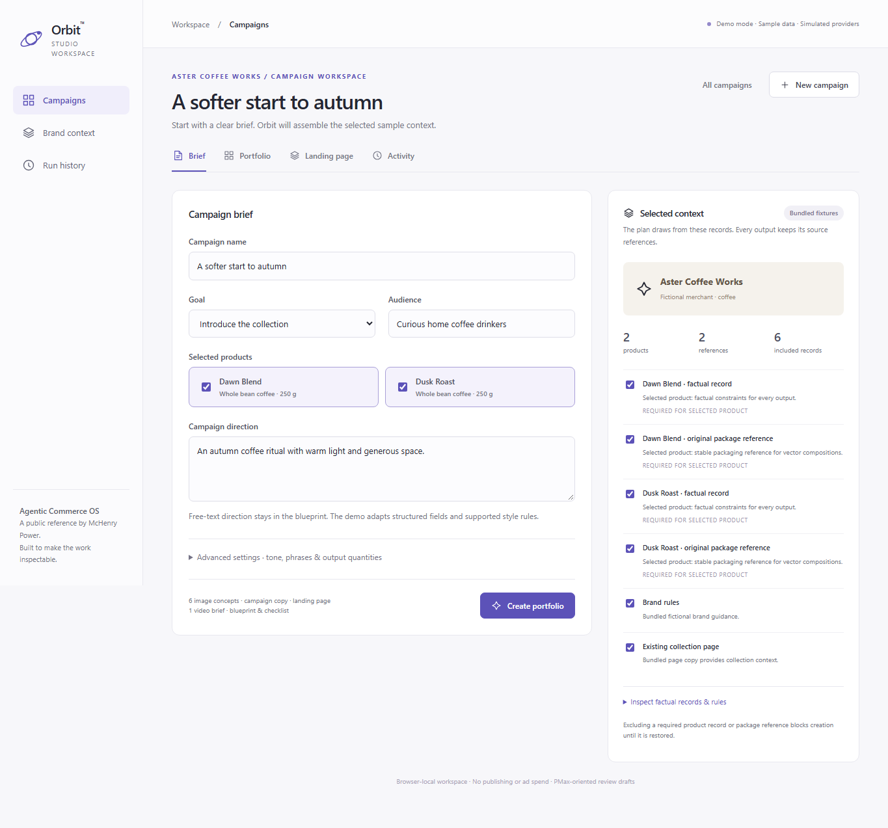
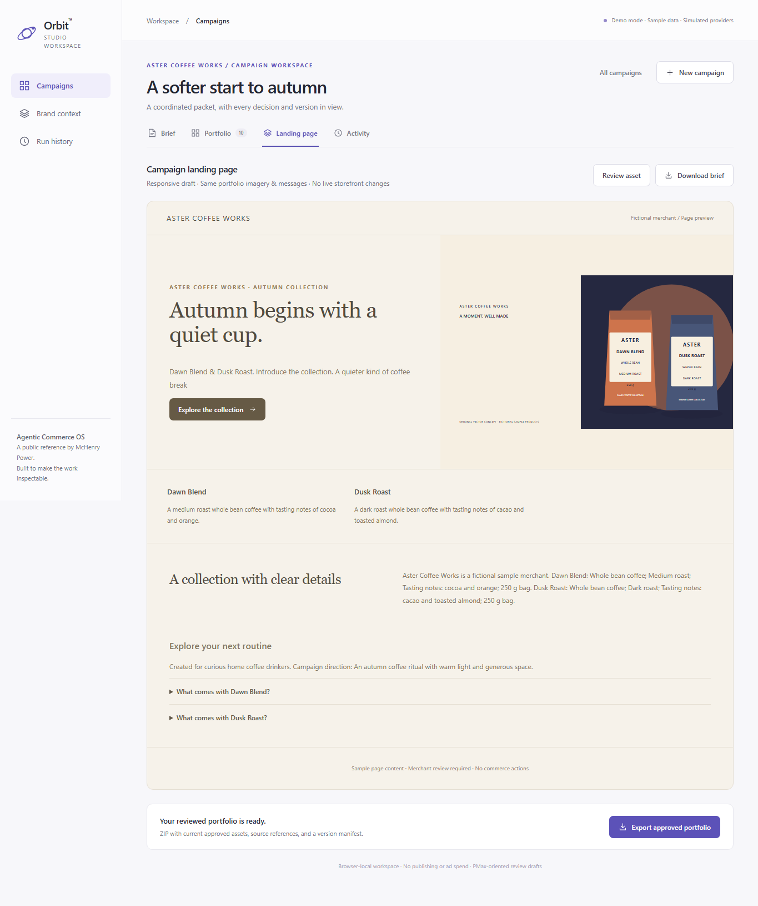
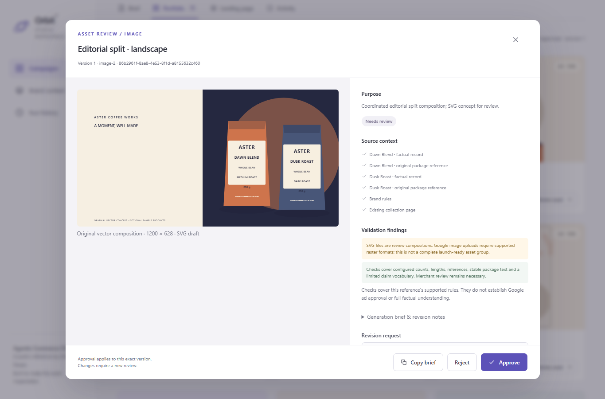

# Working product gallery

These screenshots are captured from the running Orbit Studio reference application with invented merchant fixtures. They show functioning UI, not generated product mockups or a deployed commercial service.

## Campaign brief and selected context

*Working reference demo · Sample data · Simulated providers*

The sample explicitly populates a brief. Selected references, product facts, and brand rules form the inspectable context for the campaign plan.

## Coordinated portfolio and review

*Working reference demo · Sample data · Simulated providers*

Original SVG compositions accompany copy, landing material, a video brief, and the campaign blueprint. Review is tied to the exact asset version. A targeted revision retains unrelated outputs.

## Landing-page preview and export

*Working reference demo · Sample data · Simulated providers*

The preview reuses the same portfolio messages and artwork. Export contains reviewed drafts and a manifest; it does not publish a store page or advertising campaign.

Focused asset review

*Working reference demo · Sample data · Simulated providers*

Purpose, provenance, findings, revision requests, and exact-version approval are visible in a focused review dialog.

Follow the [demo guide](demo-guide.md) to reproduce the journey. [Architecture](architecture.md), [review lifecycle](workflow-and-domain.md#review-and-revision), and [channel scope](channel-specs.md) explain the implementation behind the screens.
