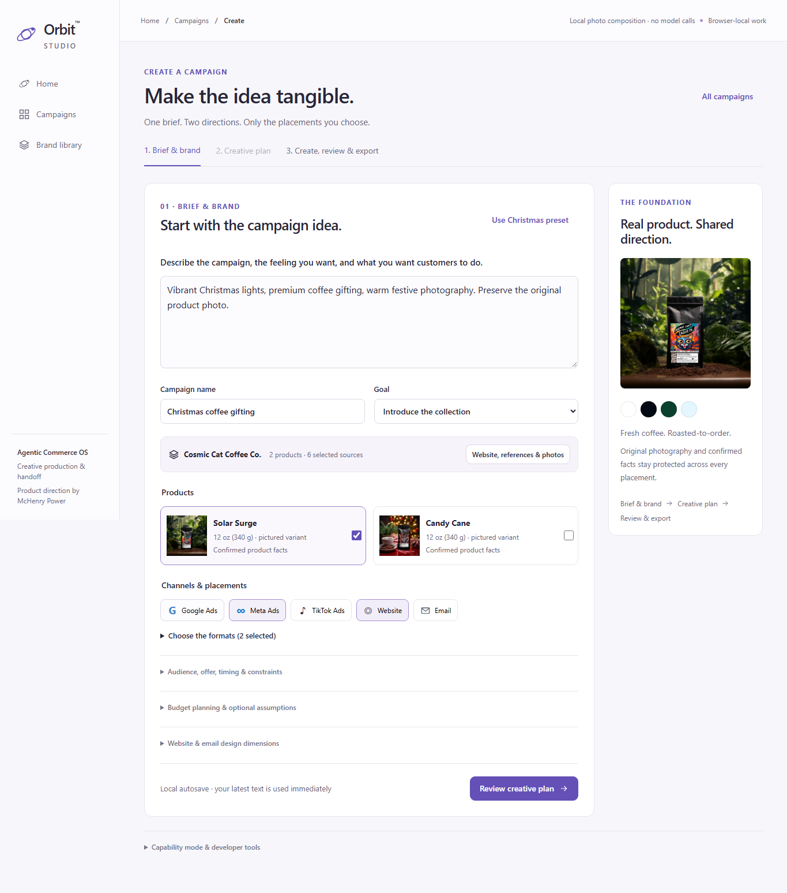
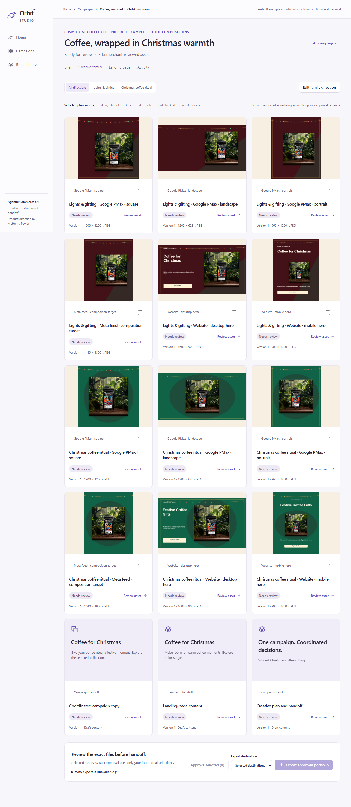
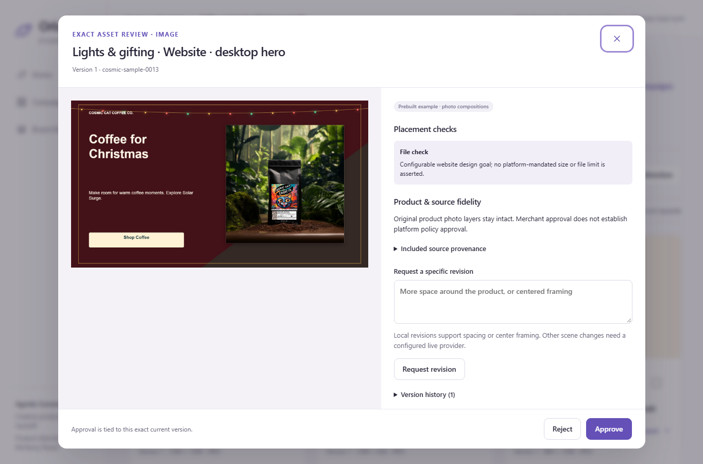
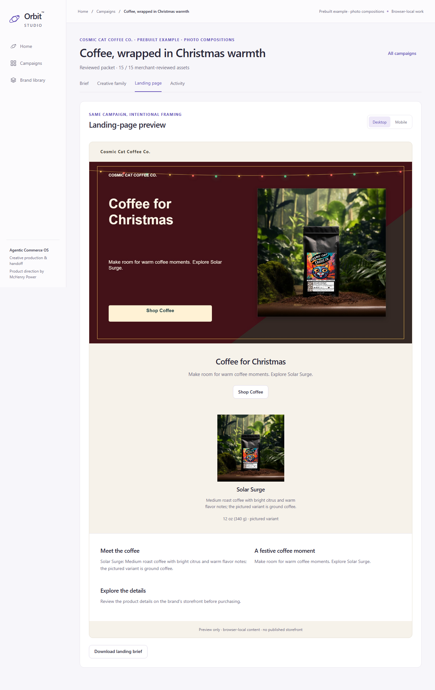
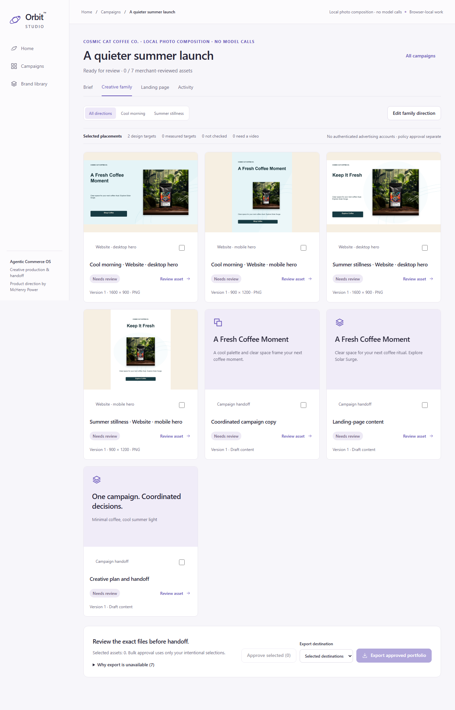
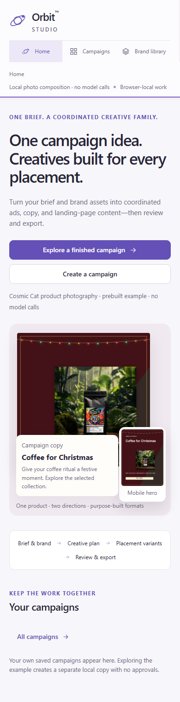
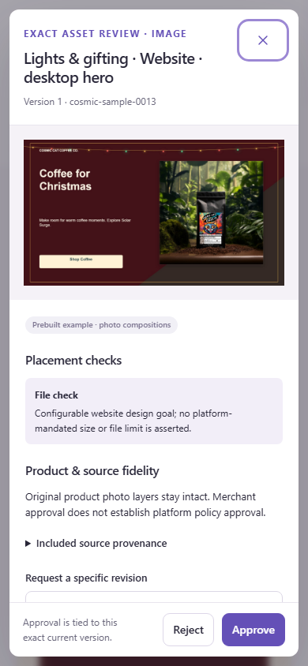
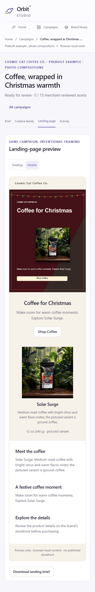

# V2 candidate gallery

These are screenshots of the real, locally running V2 production build, captured on **2026-10-03**. Cosmic Cat photos are owner-authorized public references. The Christmas example is prebuilt local composition; the summer campaign was newly composed through the app. No model calls or advertising-account connections are shown. Merchant decisions in the review/landing captures are acceptance-test interactions, not commercial or platform approvals.

The [current public Pages demo](https://mchenry-power-dev.github.io/orbit-agentic-commerce/) remains V1. These candidate captures do not establish a public V2 service or live generative workflow.

## Start with an outcome

_V2 candidate · Authorized Cosmic Cat photos · Prebuilt local composition · No model calls_

Home shows the coordinated outcome before requesting a brief. Exploring the example creates a separate browser-local campaign with no copied approvals.

Brief, brand references and editable interpretation

_V2 candidate · Authorized Cosmic Cat photos · Prebuilt local composition · No model calls_

The brief retains products, references, campaign intent and selected placements. The interpretation exposes two directions and local-mode limits for review before creation.

Complete Christmas creative family and selected placements

_V2 candidate · Authorized Cosmic Cat photos · Prebuilt local composition · No model calls_

Twelve native JPEG variants and three content assets form the 15-item example. The original product-photo frame remains intact. Google imagery keeps copy separate; website heroes include placement-specific overlays. The sample begins with all versions unapproved. Meta is explicitly Not checked; website targets are design choices.

Exact asset review, provenance and targeted revision

_V2 candidate · Authorized Cosmic Cat photos · Prebuilt local composition · No model calls_

Review exposes the actual version, placement finding, source fidelity and revision controls. Local revisions support spacing or centered framing; other scene changes require configured live generation. Approval applies to this exact current version.

Desktop landing preview and reviewed content

_V2 candidate · Authorized Cosmic Cat photos · Prebuilt local composition · No model calls_

The intended desktop hero retains its complete composition. The preview carries actual landing copy and the pictured product facts. Its reviewed state comes from intentional acceptance-test decisions. Downloading a landing brief or approved packet does not publish a storefront.

Contrasting summer composition with the same protected product photo

_V2 candidate · Authorized Cosmic Cat photos · New local composition · No model calls_

A cool, minimal, no-holiday brief changes the surrounding design and copy while retaining Solar Surge's verified product record and unchanged photo. Only the selected website targets are created. This demonstrates supported bounded cues rather than arbitrary semantic image generation.

Narrow home, exact review and Mobile-selected landing

_V2 candidate · Authorized Cosmic Cat photos · Prebuilt local composition · No model calls_

The narrow workflow keeps navigation and review actions reachable. Selecting Mobile uses the intended portrait hero at its natural aspect ratio, followed by confirmed product details and coordinated sections. These real captures were inspected without horizontal overflow; they do not establish physical-device or accessibility certification.

Preserved historical V1 screenshots

[Brief](images/01-brief.png) · [Portfolio](images/02-portfolio.png) · [Landing](images/03-landing.png) · [Focused review](images/04-review.png)

_Working reference demo · Sample data · Simulated providers_

These earlier captures use fictional merchant fixtures and original SVG drafts. They document the preserved V1 reference; they are separate from the V2 raster/photo experience.

See the [demo guide](demo-guide.md), [architecture](architecture.md), [review lifecycle](workflow-and-domain.md#review-and-revision), [recorded tests](testing-and-evaluation.md) and [placement scope](channel-specs.md).
