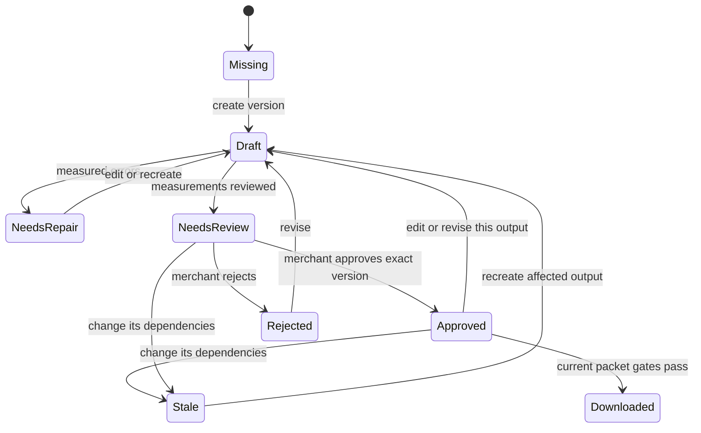

# Workflow and domain

V2 organizes **campaign → two creative directions → placement variants → exact versions**. The description expresses intent; confirmed brand sources constrain facts. An editable interpretation precedes creation. The finished example is a useful starting point, but copying it does not preapprove any output for the merchant.

## Records and controls

| Record             | Meaning                                                                                                                     |
| ------------------ | --------------------------------------------------------------------------------------------------------------------------- |
| Brief              | Description, goal, selected products/channels/placements, optional audience/offer/tone/phrases/dates and budget assumptions |
| Brand source       | Retrieved or visitor-supplied content with role, inclusion, provenance and confirmed product association                    |
| Creative plan      | Two directions, proposed copy/landing/video concept, conflicts, selected sources and captured preferences                   |
| Composition recipe | Direction, actual placement dimensions, protected photos, framing, overlays and spacing                                     |
| Asset version      | Raster or content, dependency fingerprint, findings, mode and source IDs                                                    |
| Approval           | Merchant decision tied to the exact current version                                                                         |
| Run                | Bounded attempts, completed checkpoints, interruption/failure state and concise events                                      |
| Export manifest    | Current approved versions mapped to exact filenames, placements, findings and provenance                                    |

Goal, products and channels remain near the brief. Optional details include audience, offer, tone, keywords, complete required/prohibited phrases, dates, website/email dimensions and budget. Budget distinguishes currency, period and daily/lifetime intent; allocations use the same basis and must total correctly. Empty amounts remain empty, zero remains zero. Optional CPA/ROAS/margin values are assumptions, not forecasts, private economics or spending authorization.

The local planner supports bounded theme cues and exposes its limits. Keywords can guide those cues; they are not exported paid-search account configuration. Arbitrary instructions require semantic service interpretation. Current instructions take precedence over brand defaults and remembered tone; remembered spacing is captured into a new plan.

Default required-phrase scope is **campaign-copy**: actual headline, long-headline, description or CTA fields. A complete 31–90 weighted-character phrase can use a long field while shorter headline alternatives remain intact. A phrase exceeding Google's 90-character supported long-copy limit conflicts when Google is selected. Use it as a website body note or shorten the requirement; it is not silently moved, split or truncated. Required/prohibited contradictions require resolution.

## Main journey

1. Explore a finished Cosmic Cat campaign, or describe a new campaign and choose its products and placements.
2. Inspect brand facts, original photos and page/inspiration roles. Import requires its configured service; a saved URL alone is not a successful import. Confirm actual product facts and photo associations.
3. Interpret, inspect and edit the creative plan. Resolve conflicting instructions and confirm the two directions.
4. Create only selected compatible outputs. The engine encodes real rasters, retains recipes, checks measurements and surfaces unknown rules.
5. Review a family or exact variant. Approve selected current versions intentionally, edit copy, reject or revise a targeted output.
6. Preview landing content and export a current approved destination packet. The manifest identifies each exact approved version; exporting does not publish.

The protected original photos are complete frames. A no-holiday request using Candy Cane's original festive photo conflicts until an alternative approved reference is supplied. The Christmas and contrast examples use Solar Surge so the same verified product can support different surrounding designs.

## Review and revision

Conditions are stored separately in the [typed domain](../src/domain/studio.ts); “Downloaded” describes an export action. Warnings such as Meta **Not checked** or missing platform policy approval remain visible even after merchant review. Merchant approval is not a connected account, a platform policy decision or proof of creative effectiveness.

A single-variant revision creates one new version and clears that variant's approval. A family change invalidates dependent variants in that family. Copy/offer changes preserve text-free images when their visual dependencies remain current, while affected overlaid images, copy and handoff need review. Current required sources are checked again at export.

## Recovery and continuity

One active run is permitted; completed versions are persisted checkpoints. Bounded partial failures preserve unrelated approvals, and resume selects missing or stale work. A failed targeted revision resumes its original asset selection and note, preserving the prior version until a replacement succeeds. Live scene checkpoints are saved before local rendering; resuming a render failure reuses the scene, while revised and base scenes stay distinct. Late timed-out provider results do not become duplicate versions. Browser refresh restores local records; work does not continue after closing the browser.

V2 retains the earlier V1 database record separately. Use `?legacy=1` to inspect prior Aster/Harbor campaigns through the preserved interface. Navigation and local deletion are distinct from generation; no route changes advertising spend or a storefront. See [architecture](architecture.md), [demo guide](demo-guide.md) and [channel checks](channel-specs.md).
