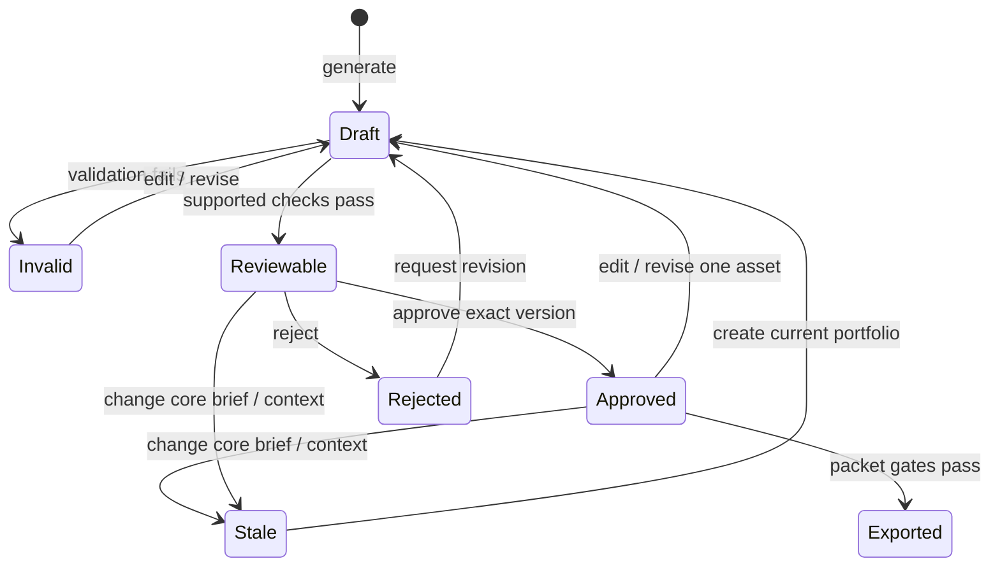

# Workflow and domain

## Campaign records

| Record | Meaning |
| --- | --- |
| Brief | Merchant, goal, product IDs, audience, direction, optional structured controls; campaign-level revision |
| Context snapshot | Included products, brand rules, references/page content, inclusion reasons, exclusions |
| Asset specification | Stable ID, type/purpose, required fields/dimensions, source context |
| Asset version | Content for a specification at a particular brief/context revision |
| Validation finding | Rule, severity, explanation, affected content/asset |
| Approval | Merchant decision tied to the exact asset version |
| Run event | Persisted step outcome, attempt, time, and relevant references |
| Export manifest | Campaign/channel provenance and approved-version-to-file references |

Product records constrain factual output. Excluding a reference removes it from planned provenance; a missing required product/packaging reference blocks run preflight until restored. The deterministic supported rule set checks prohibited phrases and unsupported product claims. It cannot establish all claims in arbitrary free text.

## From brief to portfolio

1. **Start:** choose an explicitly prepopulated sample or a new campaign. Goal, products, audience, and campaign direction are required.
2. **Context:** inspect inclusion reasons and choose which bundled references guide the packet. There is no authenticated retrieval or runtime scraping.
3. **Plan:** create stable specifications for coordinated images, copy, landing material, a video brief, and a blueprint/checklist. Optional controls and supported saved preferences affect that plan.
4. **Execute:** asynchronous simulated providers produce drafts. The real engine persists transitions/events, validates results, and bounds retries.
5. **Review:** inspect purpose, provenance, findings, and version; approve, reject, edit supported copy, or request a narrow revision.
6. **Export:** download approved current drafts only when the required packet is valid, complete, current, and reviewed.

## Review and revision

The diagram describes lifecycle meaning; source represents these conditions separately. “Exported” denotes the download event, not a stored asset status. Approval never migrates automatically to an edited version. Regenerating one item appends that item's new version and preserves unrelated content/approvals. A core brief/context change requires a current plan and new review for affected assets.

An invalid, missing, stale, or unreviewed required output blocks export with a reason. Rejection is a merchant decision, not a provider exception. Revision notes persist with the campaign. Stored preferences such as avoiding crowded compositions are reused for supported future planning; they are not model training.

## Recovery and reset

Refreshing a run restores browser-local records and allows remaining work to resume. Explicit restart does not silently erase independent approved work. Bounded failures remain visible in activity; a provider failure is not a successful campaign.

Reset requires confirmation and restores the demo's local starting state. It is not a remote deletion or account action. Downloads and clipboard actions are local review conveniences; no action in this reference publishes a storefront, activates advertising, or spends money.
